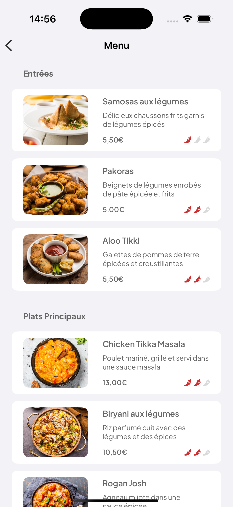

# Complétez une interface dynamique en SwiftUI

Ce projet fait partie du parcours "Développeur d'application iOS" d'OpenClassrooms (projet 3).

L'objectif de ce projet était d'implémenter chaque vue, le modèle et le ViewModel étant fournis.
Pour concevoir les vues, des maquettes étaient mises à disposition via l'application Figma.

# Captures d'écran de l'application

<table style="border: none">
  <tr>
    <td align="center">
       
      Welcome View
    </td>
    <td align="center">
       
      Menu View
    </td>
    <td align="center">
       
      Details View
    </td>
  </tr>
</table>
